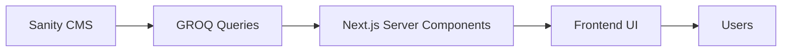

# MÉDECIN AUTO — PRODUCT REQUIREMENTS DOCUMENT (PRD)

# Plateforme Premium de Services et Mobilité Automobile

---

# Vision du Projet

# Vision & Positionnement de MÉDECIN AUTO

MÉDECIN AUTO est bien plus qu’un simple garage automobile.
C’est une plateforme moderne de services et de mobilité automobile conçue pour répondre aux nouveaux besoins des conducteurs, des entreprises et des passionnés d’automobile au Sénégal.

La marque combine trois piliers stratégiques complémentaires :

* la réparation et l’entretien mécanique,
* la location de véhicules,
* la vente de véhicules.

Cette approche permet à MÉDECIN AUTO de se positionner comme un écosystème automobile complet capable d’accompagner le client durant tout le cycle de vie de son véhicule.

---

## Une Nouvelle Génération de Services Automobiles

Le marché automobile sénégalais évolue rapidement.
Les clients recherchent désormais :

* plus de transparence,
* plus de professionnalisme,
* une meilleure qualité de service,
* une expérience digitale moderne,
* des partenaires automobiles fiables.

Cependant, une grande partie des acteurs du secteur souffre encore :

* d’un manque de présence digitale professionnelle,
* d’une faible qualité d’expérience utilisateur,
* d’un manque de confiance,
* d’une communication peu moderne,
* d’un faible niveau de structuration des services.

MÉDECIN AUTO vient répondre à cette problématique en proposant une plateforme automobile premium pensée selon les standards digitaux modernes internationaux.

---

# Les 3 Piliers Stratégiques

## 1. Réparation & Entretien Automobile

MÉDECIN AUTO agit comme un véritable “médecin du véhicule”.

L’objectif est de proposer des services mécaniques fiables, rapides et professionnels permettant aux propriétaires de véhicules de rouler en toute sécurité.

Les services incluent :

* diagnostic automobile,
* entretien général,
* vidange,
* réparation moteur,
* pneumatique,
* climatisation,
* suivi assurance,
* accompagnement technique,
* maintenance préventive.

La plateforme doit inspirer la confiance grâce à :

* une communication claire,
* des explications transparentes,
* des visuels professionnels,
* des témoignages clients,
* des indicateurs de qualité.

---

## 2. Location de Véhicules

MÉDECIN AUTO développe également une activité de mobilité moderne grâce à la location de véhicules.

L’objectif est de permettre aux particuliers et aux entreprises de louer des véhicules fiables, propres et bien entretenus pour :

* les déplacements professionnels,
* les événements,
* les voyages,
* les besoins temporaires,
* les missions d’entreprise.

La plateforme doit offrir :

* une expérience de réservation simple,
* une visualisation claire des véhicules disponibles,
* des fiches véhicules détaillées,
* une expérience premium similaire aux standards internationaux.

---

## 3. Vente de Véhicules

La vente automobile constitue le troisième pilier stratégique.

MÉDECIN AUTO souhaite devenir une référence de confiance dans la vente de véhicules grâce à :

* des véhicules certifiés,
* des véhicules inspectés,
* une transparence sur l’état des véhicules,
* une expérience client rassurante,
* un accompagnement professionnel.

La plateforme devra mettre fortement en avant :

* la qualité des véhicules,
* les caractéristiques techniques,
* les galeries photos premium,
* les options de financement,
* les demandes de renseignements rapides.

---

# Positionnement Premium

MÉDECIN AUTO ne doit jamais être perçu comme un garage traditionnel.

Le positionnement recherché est celui d’une :

## “Plateforme Premium de Services et Mobilité Automobile”

L’identité de marque doit évoquer :

* expertise automobile,
* modernité,
* innovation,
* fiabilité,
* professionnalisme,
* excellence de service.

Le branding doit s’inspirer des expériences proposées par :

* les centres de service premium,
* les concessions automobiles modernes,
* les plateformes de mobilité internationales,
* les marques automobiles haut de gamme.

---

# Objectifs de la Plateforme

La plateforme digitale doit permettre :

## Génération de Leads

Transformer les visiteurs en prospects qualifiés grâce à des CTA stratégiques et des formulaires optimisés.

---

## Acquisition de Clients

Améliorer la visibilité de MÉDECIN AUTO sur Google et les réseaux sociaux grâce à une stratégie SEO moderne.

---

## Renforcement de la Confiance

Créer une image professionnelle forte afin de rassurer les clients avant même le premier contact.

---

## Digitalisation des Services

Faciliter la réservation, les demandes de devis, les demandes de location et les prises de contact.

---

## Différenciation Concurrentielle

Créer une expérience premium unique sur le marché automobile sénégalais.

---

# Vision Long Terme

À long terme, MÉDECIN AUTO ambitionne de devenir :

* une référence automobile nationale,
* une marque premium reconnue,
* une plateforme de mobilité complète,
* un acteur majeur de l’innovation automobile au Sénégal.

La plateforme devra être pensée dès le départ pour permettre :

* l’expansion multi-agences,
* la gestion de flotte,
* les paiements en ligne,
* les applications mobiles,
* les dashboards clients,
* les services B2B,
* les marketplaces automobiles,
* les abonnements et memberships.

---

# Expérience Utilisateur Recherchée

Le site web doit immédiatement transmettre :

* professionnalisme,
* confiance,
* rapidité,
* modernité,
* expertise automobile.

L’utilisateur doit ressentir une expérience :

* fluide,
* premium,
* rassurante,
* moderne,
* performante.

Chaque interaction doit renforcer la perception d’une entreprise automobile sérieuse et haut de gamme.

---

# Message de Marque

## MÉDECIN AUTO

### “Nous prenons soin de votre véhicule comme un médecin prend soin de ses patients.”

Cette signature doit devenir le cœur émotionnel du branding et de l’expérience utilisateur.


---

# Stack Technique

# Architecture Technique Moderne

La plateforme MÉDECIN AUTO sera développée avec une stack technologique moderne, performante et scalable permettant d’offrir :

* une excellente expérience utilisateur,
* des performances élevées,
* une architecture maintenable,
* un référencement SEO avancé,
* une gestion de contenu flexible,
* une évolutivité à long terme.

L’objectif est de construire une plateforme automobile premium répondant aux standards web modernes 2026.

---

# Frontend Architecture

Le frontend représente la partie visible de la plateforme.
Il doit être :

* ultra rapide,
* responsive,
* moderne,
* immersif,
* SEO friendly,
* scalable.

L’architecture frontend sera basée sur l’écosystème React moderne avec Next.js App Router.

---

# Next.js 15+

## Rôle

Next.js sera le framework principal de l’application.

Il permettra :

* le rendu serveur performant,
* le SEO avancé,
* l’optimisation automatique,
* le routing moderne,
* la gestion hybride SSR/SSG/ISR,
* le streaming React,
* l’optimisation des performances.

---

## Pourquoi Next.js ?

Next.js est aujourd’hui le framework React de référence pour les plateformes professionnelles modernes.

Il est particulièrement adapté à MÉDECIN AUTO grâce à :

### Performance

* chargement ultra rapide,
* optimisation automatique des assets,
* lazy loading,
* streaming.

# Architecture SEO Avancée

Le référencement naturel (SEO) constitue un pilier stratégique majeur du projet MÉDECIN AUTO.

L’objectif est de positionner la plateforme parmi les premiers résultats Google au Sénégal sur les recherches liées à :

* la réparation automobile,
* la location de véhicules,
* la vente de véhicules,
* les services mécaniques,
* les services de mobilité automobile.

L’architecture SEO doit permettre :

* une visibilité maximale,
* un excellent positionnement Google,
* une augmentation du trafic organique,
* une génération continue de leads,
* une forte crédibilité digitale.

La stratégie SEO sera intégrée dès la conception technique du projet afin d’assurer des performances optimales à long terme.

---

# Génération de Metadata Dynamique

## Objectif

Chaque page de la plateforme devra générer automatiquement des métadonnées SEO optimisées.

Cela permettra :

* d’améliorer le référencement,
* d’augmenter le taux de clic (CTR),
* d’optimiser le partage sur les réseaux sociaux,
* d’améliorer la compréhension du site par Google.

---

## Pourquoi les Metadata Dynamiques ?

Les pages du site seront alimentées dynamiquement depuis Sanity CMS.

Par conséquent :

* chaque service,
* chaque véhicule,
* chaque article blog,
* chaque page SEO,

devra générer automatiquement :

* un titre SEO,
* une meta description,
* des mots-clés,
* une image Open Graph,
* des données structurées.

---

## Utilisation de la Next.js Metadata API

La plateforme utilisera la Metadata API moderne de Next.js.

Cette API permettra :

### Meta Title dynamique

Exemple :

```txt id="fh2p1x"
Réparation Automobile Premium à Dakar | MÉDECIN AUTO
```

---

### Meta Description dynamique

```txt id="yj63m1"
Diagnostic, entretien, réparation moteur, location et vente de véhicules au Sénégal. Service automobile professionnel et rapide.
```

---

### Canonical URLs

Pour éviter :

* le contenu dupliqué,
* les conflits SEO,
* les erreurs d’indexation.

---

### Meta Robots

Gestion :

* indexation,
* noindex,
* follow,
* nofollow.

---

# Rendu Serveur (Server Side Rendering)

## Objectif

Le rendu serveur permettra d’envoyer à Google un HTML déjà généré et optimisé.

Cela améliore fortement :

* le référencement,
* la vitesse de chargement,
* l’indexation,
* les performances SEO.

---

## Pourquoi le SSR est important ?

Les moteurs de recherche préfèrent :

* du contenu directement lisible,
* du HTML pré-rendu,
* des pages rapides.

Le SSR permettra donc :

### Meilleure indexation

Google pourra lire immédiatement :

* les services,
* les véhicules,
* les contenus SEO,
* les articles.

---

### Amélioration des performances

* réduction du temps de chargement,
* meilleur Core Web Vitals,
* meilleure expérience utilisateur.

---

### SEO Local

Très important pour les recherches locales :

* garage automobile Dakar,
* location voiture Sénégal,
* réparation moteur Dakar,
* vente voiture Sénégal.

---

# Sitemap Dynamique

## Objectif

Le sitemap XML permettra à Google de découvrir automatiquement toutes les pages importantes du site.

---

## Génération Automatique

Le sitemap sera généré dynamiquement à partir des contenus Sanity :

* services,
* véhicules,
* locations,
* articles blog,
* pages SEO.

---

## Avantages

### Indexation Plus Rapide

Google pourra :

* détecter rapidement les nouvelles pages,
* explorer efficacement le site.

---

### SEO Technique Optimisé

Le sitemap aidera à :

* améliorer le crawl,
* réduire les erreurs d’indexation,
* prioriser les pages importantes.

---

## Exemple de Structure Sitemap

```xml
<urlset>
  <url>
    <loc>https://medecinauto.sn/services</loc>
  </url>

  <url>
    <loc>https://medecinauto.sn/vehicules</loc>
  </url>

  <url>
    <loc>https://medecinauto.sn/location</loc>
  </url>
</urlset>
```

---

# Open Graph

## Objectif

Open Graph optimise l’affichage des pages lors du partage sur :

* Facebook,
* WhatsApp,
* LinkedIn,
* Messenger,
* Telegram.

---

## Importance Business

Les partages sociaux représentent une source importante de trafic.

Une bonne configuration Open Graph améliore :

* l’image de marque,
* le taux de clic,
* la crédibilité.

---

## Éléments Open Graph

### OG Title

Titre optimisé partage social.

---

### OG Description

Résumé attractif de la page.

---

### OG Image

Image premium automobile adaptée au partage.

---

### OG URL

URL canonique.

---

## Exemple Open Graph

```html
<meta property="og:title" content="Réparation Automobile Premium à Dakar" />
<meta property="og:description" content="Diagnostic, réparation, location et vente automobile." />
<meta property="og:image" content="https://medecinauto.sn/og-image.jpg" />
```

---

# Twitter Cards

## Objectif

Optimiser l’affichage des liens sur Twitter/X.

---

## Avantages

* meilleure visibilité,
* partage plus professionnel,
* augmentation engagement social.

---

## Types Utilisés

### Summary Large Image

Affichage premium avec grande image automobile.

---

# Structured Data (Schema.org)

## Objectif

Les données structurées permettront à Google de mieux comprendre le contenu du site.

Cela améliore :

* le SEO,
* les rich snippets,
* la visibilité Google,
* les résultats enrichis.

---

# Types de Schema.org Utilisés

## AutoRepair

Pour les services mécaniques.

---

## Vehicle

Pour les véhicules vendus ou loués.

---

## LocalBusiness

Pour le référencement local.

---

## FAQPage

Pour les FAQ enrichies.

---

## Article

Pour les articles blog.

---

## BreadcrumbList

Pour la navigation SEO.

---

# Exemple de Structured Data

```json
{
  "@context": "https://schema.org",
  "@type": "AutoRepair",
  "name": "MÉDECIN AUTO",
  "image": "https://medecinauto.sn/logo.jpg",
  "telephone": "+221XXXXXXXX",
  "address": {
    "@type": "PostalAddress",
    "addressCountry": "SN"
  }
}
```

---

# SEO Local

## Objectif

Dominer les recherches automobiles locales au Sénégal.

---

## Stratégie SEO Locale

Optimisation pour :

* Dakar,
* Rufisque,
* Thiès,
* Sénégal.

---

## Recherches Ciblées

* garage automobile Dakar,
* réparation moteur Sénégal,
* location voiture Dakar,
* vente véhicule Sénégal.

---

# Optimisation des URLs

## Structure SEO Friendly

Exemples :

```txt id="8h5x2p"
https://medecinauto.sn/services/reparation-moteur
https://medecinauto.sn/location/toyota-prado
https://medecinauto.sn/vehicules/mercedes-classe-c
```

---

# Optimisation des Images SEO

## Importance

Les images automobiles seront critiques pour :

* l’expérience utilisateur,
* le branding,
* le référencement.

---

## Optimisations

### Alt Text Automatique

Descriptions SEO des images.

---

### Formats Modernes

* WebP,
* AVIF.

---

### Lazy Loading

Chargement intelligent des images.

---

# SEO Content Strategy

## Blog Automobile

Le blog servira à générer du trafic organique via :

* conseils automobiles,
* entretien véhicule,
* sécurité routière,
* guides achat voiture,
* comparatifs véhicules.

---

# Objectifs SEO Long Terme

## Court Terme

* indexation rapide,
* visibilité locale.

---

## Moyen Terme

* domination SEO locale,
* augmentation trafic organique.

---

## Long Terme

* autorité automobile nationale,
* forte présence digitale,
* acquisition continue de clients.

---

# Performance SEO Technique

## Objectifs Core Web Vitals

| Metric | Target  |
| ------ | ------- |
| LCP    | < 2.5s  |
| CLS    | < 0.1   |
| INP    | < 200ms |

---

# Technologies SEO Utilisées

```txt id="8kq7p1"
SEO Stack
│
├── Next.js Metadata API
├── Server Side Rendering
├── Static Generation
├── Incremental Static Regeneration
├── Structured Data
├── Open Graph
├── Dynamic Sitemap
├── Robots.txt
├── Canonical URLs
└── Image Optimization
```

---

# Résultat Attendu

Cette architecture SEO permettra à MÉDECIN AUTO :

* d’obtenir une forte visibilité Google,
* de générer du trafic organique qualifié,
* d’augmenter les conversions,
* de renforcer la crédibilité de la marque,
* de devenir une référence digitale automobile au Sénégal.

Le SEO ne doit pas être considéré comme une fonctionnalité secondaire, mais comme un moteur principal de croissance business et d’acquisition client.


# Scalabilité & Architecture Évolutive

La plateforme MÉDECIN AUTO doit être conçue dès le départ comme une architecture moderne, scalable et évolutive.

L’objectif n’est pas simplement de créer un site web classique, mais de construire une plateforme automobile capable d’évoluer à long terme vers :

* une plateforme multi-services,
* une marketplace automobile,
* une application mobile,
* un dashboard client,
* une gestion de flotte,
* des services B2B,
* des systèmes de réservation avancés,
* une infrastructure multi-agences.

L’architecture technique doit donc être pensée pour supporter :

* l’augmentation du trafic,
* l’ajout de nouvelles fonctionnalités,
* l’expansion du business,
* l’évolution des besoins métier,
* les performances à grande échelle.

---

# Architecture Modulaire

## Objectif

L’architecture modulaire permet de découper l’application en blocs indépendants, réutilisables et maintenables.

Chaque fonctionnalité du projet devient un module autonome pouvant évoluer sans impacter l’ensemble de la plateforme.

---

# Pourquoi une Architecture Modulaire ?

Dans une plateforme évolutive comme MÉDECIN AUTO, les fonctionnalités vont continuellement grandir :

* ajout de nouveaux services,
* ajout de nouvelles agences,
* nouveaux modules business,
* nouvelles interfaces utilisateur,
* nouvelles APIs,
* nouveaux dashboards.

Une architecture monolithique classique deviendrait rapidement difficile à maintenir.

L’architecture modulaire permet donc :

* une meilleure organisation,
* une meilleure maintenabilité,
* une évolutivité simplifiée,
* un développement parallèle plus rapide,
* une réduction des bugs,
* une meilleure collaboration équipe.

---

# Organisation Modulaire du Projet

Chaque domaine métier sera isolé dans son propre module.

---

# Exemple d’Architecture

```txt id="7zv2p1"
src/
├── app/
├── components/
├── features/
│   ├── services/
│   ├── vehicles/
│   ├── rentals/
│   ├── blog/
│   ├── booking/
│   ├── auth/
│   └── dashboard/
├── hooks/
├── lib/
├── services/
├── sanity/
├── store/
├── types/
└── utils/
```

---

# Avantages de cette Structure

## Isolation des Fonctionnalités

Chaque module possède :

* ses composants,
* ses hooks,
* ses services,
* ses types,
* sa logique métier.

---

## Scalabilité Long Terme

Permet :

* d’ajouter facilement de nouvelles fonctionnalités,
* de séparer les responsabilités,
* de maintenir le projet propre.

---

## Collaboration Équipe

Plusieurs développeurs pourront travailler simultanément sur :

* le module location,
* le module véhicules,
* le module blog,
* le dashboard admin,
  sans conflits majeurs.

---

# API Routes

## Objectif

Les API Routes permettront de créer une couche backend directement intégrée dans Next.js.

Elles serviront à gérer :

* les formulaires,
* les réservations,
* les demandes clients,
* les notifications,
* les intégrations externes,
* les traitements serveur.

---

# Pourquoi les API Routes ?

Les API Routes permettent :

* une architecture fullstack unifiée,
* moins de complexité infrastructure,
* une meilleure sécurité,
* une excellente intégration frontend/backend.

---

# Cas d’Utilisation dans MÉDECIN AUTO

## Réservation de Services

```txt id="8xk2p4"
POST /api/book-service
```

Permet :

* d’envoyer les réservations,
* d’enregistrer les demandes,
* de notifier les administrateurs.

---

## Demandes de Location

```txt id="k4tz91"
POST /api/rental-request
```

Gestion :

* des disponibilités,
* des demandes clients,
* des validations.

---

## Contact Form

```txt id="q9v2n7"
POST /api/contact
```

Fonctionnalités :

* validation,
* anti-spam,
* envoi email,
* tracking analytics.

---

## Vehicle Inquiry

```txt id="v6pk1r"
POST /api/vehicle-inquiry
```

Permet :

* les demandes d’achat,
* les demandes de renseignements,
* les suivis commerciaux.

---

# Sécurité des API Routes

Les API devront intégrer :

* validation Zod,
* rate limiting,
* protection anti-spam,
* reCAPTCHA,
* sanitation des données,
* protection CSRF.

---

# Middleware

## Objectif

Les middlewares permettent d’exécuter du code avant le chargement des pages ou des routes API.

Ils servent à :

* sécuriser l’application,
* gérer les redirections,
* gérer les permissions,
* optimiser les performances,
* gérer la logique globale.

---

# Pourquoi les Middlewares ?

Dans une plateforme scalable, certaines règles doivent être exécutées globalement :

* authentification,
* localisation,
* sécurité,
* analytics,
* cache,
* protections.

Les middlewares permettent de centraliser cette logique.

---

# Cas d’Utilisation des Middlewares

## Authentification

Protection :

* dashboard admin,
* espace gestion,
* routes sensibles.

---

## Redirections SEO

Gestion :

* URLs obsolètes,
* redirections permanentes,
* canonical handling.

---

## Internationalisation Future

Détection automatique :

* langue,
* région,
* localisation utilisateur.

---

## Protection Sécurité

Blocage :

* IP abusives,
* spam,
* bots malveillants.

---

# Exemple de Middleware

```ts id="x4n7q2"
export function middleware(request) {
  // authentication
  // redirects
  // rate limiting
}
```

---

# Edge Rendering

## Objectif

L’Edge Rendering permet d’exécuter certaines parties de l’application au plus proche des utilisateurs grâce au réseau Edge mondial.

---

# Pourquoi l’Edge Rendering ?

Les utilisateurs de MÉDECIN AUTO peuvent venir de :

* Dakar,
* Thiès,
* Rufisque,
* ou d’autres régions.

L’Edge Rendering améliore :

* la vitesse,
* les performances,
* le temps de réponse,
* l’expérience utilisateur.

---

# Fonctionnement

Au lieu d’exécuter toutes les requêtes sur un serveur centralisé :

les calculs sont exécutés sur des serveurs Edge répartis mondialement.

Résultat :

* latence réduite,
* pages plus rapides,
* meilleure fluidité.

---

# Cas d’Utilisation Edge dans MÉDECIN AUTO

## Pages SEO

Les pages :

* services,
* véhicules,
* blog,
  seront servies rapidement.

---

## Middleware Edge

Les middlewares fonctionneront directement sur le réseau Edge pour :

* authentification,
* sécurité,
* redirections.

---

## Géolocalisation Future

L’Edge permettra :

* adaptation régionale,
* contenus localisés,
* personnalisation.

---

# Avantages Business de l’Edge Rendering

## Meilleure Expérience Utilisateur

Pages instantanées.

---

## Meilleur SEO

Google favorise :

* les sites rapides,
* les faibles temps de chargement.

---

## Meilleure Conversion

Un site plus rapide améliore :

* les leads,
* les réservations,
* les ventes.

---

# Scalabilité Future

L’architecture doit être prête pour :

---

# Multi-Agences

Possibilité future de gérer :

* plusieurs garages,
* plusieurs villes,
* plusieurs équipes.

---

# Multi-Régions

Expansion :

* Sénégal,
* Afrique de l’Ouest,
* international.

---

# Dashboard Administratif

Gestion :

* véhicules,
* réservations,
* clients,
* analytics,
* services.

---

# Marketplace Automobile

Évolution future vers :

* annonces automobiles,
* vendeurs tiers,
* marketplace complète.

---

# Application Mobile

Architecture compatible avec :

* React Native,
* APIs partagées,
* backend scalable.

---

# Architecture Scalable Finale

```txt id="j7m3p8"
Frontend
│
├── Next.js App Router
├── React Server Components
├── Modular Architecture
├── Edge Rendering
└── Middleware

Backend
│
├── API Routes
├── Sanity CMS
├── GROQ
├── Validation Layer
└── Security Layer

Infrastructure
│
├── Vercel Edge Network
├── CDN
├── ISR
├── Caching
└── Analytics
```

---

# Résultat Attendu

Cette architecture permettra à MÉDECIN AUTO :

* de supporter une forte croissance,
* d’ajouter rapidement de nouvelles fonctionnalités,
* de maintenir d’excellentes performances,
* d’offrir une expérience premium,
* de garantir une excellente maintenabilité,
* de devenir une plateforme automobile scalable moderne.

L’objectif est de construire une base technique suffisamment solide pour accompagner l’évolution de MÉDECIN AUTO pendant plusieurs années sans refonte majeure.


# Expérience Développeur (Developer Experience - DX)

L’Expérience Développeur (Developer Experience ou DX) constitue un élément stratégique dans la réussite du projet MÉDECIN AUTO.

Une plateforme moderne ne doit pas seulement être performante pour les utilisateurs finaux ; elle doit également être agréable à développer, maintenir et faire évoluer.

L’objectif est de mettre en place un environnement de développement moderne permettant :

* un développement rapide,
* une meilleure qualité de code,
* une maintenance simplifiée,
* une réduction des bugs,
* une collaboration efficace entre développeurs,
* une évolutivité à long terme.

Grâce à l’écosystème Next.js 15+, React 19 et TypeScript, l’équipe bénéficiera d’un environnement de travail particulièrement productif.

---

# Routing Moderne avec App Router

## Présentation

Le projet utilisera le système **App Router** de Next.js.

Cette nouvelle architecture remplace progressivement l’ancien système Pages Router et constitue aujourd’hui la norme recommandée par Vercel.

---

## Pourquoi App Router ?

L’App Router apporte :

* une meilleure organisation,
* des performances supérieures,
* une architecture plus intuitive,
* une séparation claire des responsabilités.

---

## Organisation des Routes

Exemple :

```txt
src/app
│
├── page.tsx
├── about/page.tsx
├── services/page.tsx
├── services/[slug]/page.tsx
├── rentals/page.tsx
├── vehicles/page.tsx
├── blog/page.tsx
└── contact/page.tsx
```

Chaque dossier représente automatiquement une route.

Cela rend la navigation du projet extrêmement simple à comprendre.

---

## Layouts Partagés

L’App Router permet de définir des layouts réutilisables.

Exemple :

```txt
app/
│
├── layout.tsx
├── page.tsx
│
├── services/
│   ├── layout.tsx
│   └── page.tsx
```

Cela permet :

* de mutualiser les composants,
* de réduire la duplication,
* d’améliorer les performances.

---

## Loading States Intégrés

Chaque page peut disposer de son propre écran de chargement.

Exemple :

```txt
loading.tsx
```

Avantages :

* meilleure UX,
* chargement progressif,
* perception de rapidité.

---

## Error Boundaries

Chaque section peut gérer ses erreurs indépendamment.

Exemple :

```txt
error.tsx
```

Cela améliore :

* la stabilité,
* la robustesse,
* l’expérience utilisateur.

---

## Route Groups

Permettent d’organiser les routes sans impacter les URLs.

Exemple :

```txt
app/
├── (marketing)/
├── (admin)/
└── (dashboard)/
```

Cette fonctionnalité sera particulièrement utile pour :

* le site public,
* l’espace administrateur,
* les futurs dashboards.

---

# TypeScript Natif

## Présentation

TypeScript sera utilisé sur l’ensemble du projet.

Next.js offre un support TypeScript de première classe dès l’installation.

---

## Pourquoi TypeScript ?

Dans un projet destiné à évoluer sur plusieurs années, la sécurité du code est essentielle.

TypeScript apporte :

* sécurité,
* robustesse,
* maintenabilité,
* documentation implicite.

---

## Réduction des Bugs

Grâce au typage strict :

```ts
type Vehicle = {
  id: string;
  title: string;
  price: number;
}
```

Les erreurs sont détectées dès le développement.

Cela réduit considérablement :

* les bugs en production,
* les erreurs de logique,
* les incohérences de données.

---

## Autocomplétion Intelligente

Les développeurs bénéficient :

* d’une meilleure productivité,
* d’une navigation rapide,
* d’une meilleure compréhension du code.

Les IDE modernes comme VS Code exploitent pleinement TypeScript.

---

## Typage des Données Sanity

Les données provenant du CMS pourront être fortement typées :

```ts
type Service = {
  title: string;
  slug: string;
  description: string;
}
```

Cela garantit :

* cohérence frontend/backend,
* meilleure qualité du code,
* développement plus rapide.

---

## Typage des APIs

Les API Routes bénéficieront également d’un typage strict :

```ts
type BookingRequest = {
  name: string;
  phone: string;
  serviceId: string;
}
```

Ce qui réduit fortement les erreurs lors des échanges de données.

---

# Optimisations Intégrées

## Présentation

Next.js intègre nativement de nombreuses optimisations.

L’équipe n’aura pas besoin de développer ou maintenir des solutions complexes.

---

# Optimisation Automatique des Images

Grâce au composant :

```tsx
<Image />
```

Next.js gère automatiquement :

* compression,
* responsive images,
* lazy loading,
* formats modernes.

---

## Optimisation du JavaScript

Next.js réalise automatiquement :

* code splitting,
* tree shaking,
* bundle optimization.

Résultat :

* moins de JavaScript envoyé,
* chargement plus rapide,
* meilleures performances.

---

## Optimisation des Polices

Les polices seront chargées via :

```tsx
next/font
```

Avantages :

* meilleure performance,
* suppression des CLS,
* chargement optimisé.

---

## Optimisation du Rendu

Next.js permet :

### Server Components

Moins de JavaScript côté client.

---

### Static Generation

Pages ultra rapides.

---

### Incremental Static Regeneration

Mises à jour intelligentes du contenu.

---

### Streaming React

Chargement progressif du contenu.

---

# Excellente Maintenabilité

## Objectif

Construire une plateforme capable d’évoluer pendant plusieurs années sans devenir difficile à maintenir.

---

# Architecture Claire

Chaque fonctionnalité sera isolée :

```txt
features/
├── services/
├── vehicles/
├── rentals/
├── blog/
└── booking/
```

Cela facilite :

* l’ajout de fonctionnalités,
* les corrections,
* les évolutions.

---

# Réutilisation Maximale

Les composants seront conçus pour être réutilisables :

```txt
components/
├── Hero
├── ServiceCard
├── VehicleCard
├── CTASection
└── ContactForm
```

Un même composant pourra être utilisé sur plusieurs pages.

---

# Standards de Développement

Le projet intégrera :

### ESLint

Analyse qualité du code.

---

### Prettier

Formatage automatique.

---

### Husky

Vérification avant commit.

---

### Commit Convention

Historique Git propre et cohérent.

---

# Documentation du Code

Le code devra être :

* lisible,
* documenté,
* structuré,
* explicite.

Objectif :

Permettre à un nouveau développeur d’être opérationnel rapidement.

---

# Collaboration d’Équipe

L’architecture permettra à plusieurs développeurs de travailler simultanément sur :

* les services,
* les véhicules,
* la location,
* le blog,
* le dashboard.

Sans créer de conflits importants.

---

# Maintenance Long Terme

L’objectif est de réduire :

* la dette technique,
* les coûts de maintenance,
* les temps de correction.

Tout en facilitant :

* les nouvelles fonctionnalités,
* les mises à jour,
* les optimisations futures.

---

# Bénéfices Concrets pour MÉDECIN AUTO

Cette approche permettra :

### Développement Plus Rapide

Livraison accélérée des nouvelles fonctionnalités.

---

### Réduction des Bugs

Détection précoce des erreurs grâce à TypeScript.

---

### Scalabilité

Ajout simple de nouveaux modules.

---

### Maintenance Simplifiée

Code clair et structuré.

---

### Productivité Équipe

Meilleure collaboration entre développeurs.

---

### Pérennité du Projet

Architecture capable de supporter la croissance future de MÉDECIN AUTO.

---

# Résultat Attendu

L’expérience développeur doit permettre à l’équipe technique de travailler efficacement sur une plateforme moderne, robuste et évolutive.

Grâce à :

* Next.js App Router,
* TypeScript,
* React 19,
* outils de qualité intégrés,
* architecture modulaire,

MÉDECIN AUTO disposera d’une base technique professionnelle capable d’évoluer pendant plusieurs années tout en conservant d’excellentes performances et une maintenance maîtrisée.


---

# Fonctionnalités Next.js Utilisées

La plateforme MÉDECIN AUTO sera développée en s’appuyant sur les fonctionnalités les plus avancées de Next.js 15 afin de garantir :

* des performances exceptionnelles,
* une excellente expérience utilisateur,
* une architecture scalable,
* un référencement SEO optimal,
* une maintenance simplifiée.

L'utilisation du nouvel **App Router** constitue le socle architectural principal du projet.

Cette approche permet de construire une application moderne, performante et adaptée à une croissance future importante.

---

# App Router

## Présentation

Le projet utilisera le système **App Router**, qui représente la nouvelle architecture officielle recommandée par l'équipe Next.js.

Contrairement à l'ancien système basé sur le dossier `pages`, l'App Router offre :

* une meilleure organisation du code,
* un routage plus intuitif,
* une gestion avancée des layouts,
* des performances supérieures,
* un support natif des Server Components.

Cette architecture est particulièrement adaptée à un projet comme MÉDECIN AUTO qui combine :

* contenu dynamique,
* catalogue de véhicules,
* pages de services,
* blog,
* réservation,
* futures extensions métiers.

---

# Layouts

## Objectif

Les layouts permettent de partager des éléments d'interface entre plusieurs pages sans duplication de code.

Ils constituent l'une des fonctionnalités les plus puissantes de l'App Router.

---

## Pourquoi les Layouts ?

Dans MÉDECIN AUTO, certaines parties de l'interface doivent apparaître sur l'ensemble du site :

* Header,
* Navigation,
* Footer,
* WhatsApp Floating Button,
* Cookie Banner,
* CTA persistants.

Sans layout, ces éléments devraient être recréés sur chaque page.

Avec App Router, ils sont centralisés dans un fichier unique.

---

## Architecture des Layouts

```txt
src/app
│
├── layout.tsx
├── page.tsx
│
├── services/
│   ├── layout.tsx
│   └── page.tsx
│
├── vehicles/
│   ├── layout.tsx
│   └── page.tsx
```

---

## Layout Global

Le layout principal contiendra :

### Header Premium

* logo MÉDECIN AUTO,
* menu navigation,
* CTA principal,
* accès WhatsApp.

---

### Footer

* coordonnées,
* réseaux sociaux,
* liens utiles,
* mentions légales.

---

### Providers

Gestion :

* thème,
* analytics,
* animations,
* contexte global.

---

## Avantages

### Réduction de la Duplication

Un seul composant utilisé partout.

---

### Maintenance Simplifiée

Une modification est automatiquement répercutée sur toutes les pages.

---

### Performance

Les layouts ne sont pas rechargés lors des changements de page.

Cela améliore considérablement la fluidité.

---

# Nested Routes

## Présentation

Les Nested Routes permettent de créer une hiérarchie logique entre les pages.

---

## Pourquoi les Nested Routes ?

MÉDECIN AUTO possède plusieurs catégories de contenus :

* services,
* véhicules,
* location,
* blog,
* FAQ.

L'organisation hiérarchique devient donc essentielle.

---

## Exemple

```txt
/services
/services/diagnostic
/services/vidange
/services/climatisation

/vehicles
/vehicles/toyota-prado
/vehicles/mercedes-c-class

/rentals
/rentals/suv
/rentals/business
```

---

## Avantages

### URLs SEO Friendly

Exemples :

```txt
https://medecinauto.sn/services/reparation-moteur

https://medecinauto.sn/vehicles/toyota-prado

https://medecinauto.sn/rentals/toyota-hilux
```

Ces URLs sont :

* lisibles,
* optimisées SEO,
* compréhensibles par Google.

---

### Organisation du Projet

Chaque fonctionnalité possède son propre espace.

---

### Scalabilité

Ajout facile de :

* nouveaux services,
* nouveaux véhicules,
* nouvelles catégories.

---

# Server Components

## Présentation

Les Server Components sont l'une des innovations majeures de React et Next.js.

Par défaut, tous les composants seront exécutés côté serveur.

---

## Pourquoi les Server Components ?

Dans un site automobile, une grande partie des données est :

* statique,
* provenant du CMS,
* destinée à l'affichage.

Il n'est donc pas nécessaire d'envoyer du JavaScript inutile au navigateur.

---

## Cas d'Utilisation

### Homepage

Chargement :

* services,
* témoignages,
* FAQ,
* véhicules en vedette.

---

### Pages Services

Affichage :

* descriptions,
* images,
* avantages.

---

### Blog

Chargement des articles depuis Sanity.

---

### Catalogue Véhicules

Affichage des fiches véhicules.

---

## Avantages

### Performance

Moins de JavaScript côté client.

---

### SEO

Google reçoit immédiatement le contenu.

---

### Temps de Chargement

Pages beaucoup plus rapides.

---

### Réduction de la Taille du Bundle

Moins de code envoyé au navigateur.

---

## Exemple d'Architecture

```txt
Server Components
│
├── ServicesSection
├── FeaturedVehicles
├── Testimonials
├── FAQ
└── BlogSection
```

---

# Client Components

## Utilisation Limitée

Les Client Components seront utilisés uniquement lorsque nécessaire.

Exemples :

* sliders,
* filtres véhicules,
* formulaires,
* animations interactives,
* menu mobile.

---

## Résultat

Une application :

* plus légère,
* plus rapide,
* plus performante.

---

# Loading States

## Objectif

Les Loading States améliorent considérablement l'expérience utilisateur pendant le chargement des données.

---

## Pourquoi ?

Lorsqu'un utilisateur consulte :

* un véhicule,
* un article,
* une page service,

certaines données peuvent prendre quelques millisecondes à arriver.

Au lieu d'afficher une page vide, Next.js affiche un état intermédiaire.

---

## Exemple

```txt
loading.tsx
```

---

## Comportement

Pendant le chargement :

* Skeleton Loader,
* cartes fantômes,
* placeholders.

---

## Cas d'Utilisation

### Catalogue Véhicules

Affichage des cartes de chargement.

---

### Blog

Affichage des placeholders d'articles.

---

### Pages Services

Chargement progressif du contenu.

---

## Bénéfices UX

* perception de rapidité,
* fluidité,
* réduction du taux de rebond.

---

# Route Groups

## Présentation

Les Route Groups permettent d'organiser le projet sans modifier les URLs visibles.

---

## Pourquoi ?

À mesure que MÉDECIN AUTO évoluera, plusieurs zones apparaîtront :

* site public,
* administration,
* dashboard,
* espace client.

Les Route Groups permettent de séparer ces zones.

---

## Exemple

```txt
app/
│
├── (marketing)/
│   ├── page.tsx
│   ├── services/
│   └── blog/
│
├── (dashboard)/
│   ├── analytics/
│   ├── bookings/
│   └── vehicles/
│
├── (admin)/
│   ├── users/
│   ├── settings/
│   └── content/
```

---

## Avantages

### Organisation

Code plus propre.

---

### Scalabilité

Ajout facile de nouveaux espaces.

---

### Maintenance

Séparation claire des responsabilités.

---

# Error Handling Intégré

## Error Boundaries

Chaque section peut disposer de son propre système de gestion d'erreurs.

Exemple :

```txt
error.tsx
```

---

## Avantages

Si une section rencontre un problème :

* le reste du site continue de fonctionner,
* meilleure expérience utilisateur,
* meilleure stabilité.

---

# Not Found Pages

Gestion native des pages inexistantes.

Exemple :

```txt
not-found.tsx
```

Permet :

* expérience utilisateur cohérente,
* SEO amélioré,
* navigation fluide.

---

# Streaming React

## Objectif

Le Streaming permet d'envoyer le contenu progressivement à l'utilisateur.

---

## Fonctionnement

Au lieu d'attendre le chargement complet :

```txt
Utilisateur
      ↓
Header affiché
      ↓
Hero affiché
      ↓
Services affichés
      ↓
Véhicules affichés
      ↓
FAQ affichée
```

---

## Avantages

### Perception Instantanée

Le site semble beaucoup plus rapide.

---

### Meilleur Core Web Vitals

Amélioration :

* LCP,
* INP,
* UX globale.

---

# Résultat Attendu

Grâce à l'App Router et aux fonctionnalités modernes de Next.js 15, MÉDECIN AUTO bénéficiera :

* d'une architecture moderne,
* d'un SEO performant,
* d'une expérience utilisateur premium,
* d'une excellente maintenabilité,
* d'une forte évolutivité,
* de performances de niveau international.

Cette architecture constituera une base solide permettant à MÉDECIN AUTO d'évoluer d'un simple site vitrine vers une véritable plateforme automobile et de mobilité digitale.


---

# Server Components

## Présentation

Les **Server Components** représentent l’une des innovations les plus importantes introduites par React et adoptées nativement par Next.js App Router.

Dans l’architecture MÉDECIN AUTO, les Server Components constitueront le mode de rendu par défaut de l’application.

Contrairement aux applications React traditionnelles où la majorité du code est exécutée dans le navigateur, les Server Components sont exécutés directement sur le serveur avant d’être envoyés au client.

Cette approche permet d’offrir :

* des performances supérieures,
* une meilleure expérience utilisateur,
* un référencement SEO optimisé,
* une réduction significative de la charge côté navigateur,
* une meilleure évolutivité de la plateforme.

---

# Pourquoi Utiliser les Server Components ?

Le site MÉDECIN AUTO est principalement un site orienté contenu et consultation.

Les utilisateurs consultent :

* des services automobiles,
* des fiches véhicules,
* des offres de location,
* des articles de blog,
* des FAQ,
* des témoignages clients.

La majorité de ces données provient directement du CMS Sanity et ne nécessite pas d’interactions complexes côté client.

Dans ce contexte, exécuter systématiquement toute la logique dans le navigateur serait inutile et contre-productif.

Les Server Components permettent donc d’envoyer uniquement ce qui est nécessaire à l’utilisateur.

---

# Réduction du JavaScript Côté Client

## Problématique

Dans une application React classique, chaque composant est envoyé au navigateur avec son JavaScript associé.

Cela signifie que :

* davantage de données doivent être téléchargées,
* le navigateur doit interpréter le code,
* davantage de mémoire est consommée,
* le temps de chargement augmente.

---

## Solution Apportée par les Server Components

Avec les Server Components :

* le rendu est effectué sur le serveur,
* le HTML est généré avant d’être envoyé,
* le JavaScript inutile n’est pas transféré.

---

## Exemple

### Approche Traditionnelle

```txt
Navigateur
│
├── Téléchargement HTML
├── Téléchargement JS
├── Exécution JS
├── Requête API
└── Affichage
```

---

### Approche Server Components

```txt
Serveur
│
├── Récupération données Sanity
├── Génération HTML
└── Envoi direct au navigateur

Navigateur
│
└── Affichage immédiat
```

---

## Résultat

* moins de JavaScript,
* moins de ressources consommées,
* meilleure rapidité.

---

# Meilleures Performances

## Objectif

L’un des principaux objectifs du projet est d’obtenir des performances proches des standards des grandes plateformes internationales.

Les Server Components jouent un rôle essentiel dans cet objectif.

---

# Réduction de la Taille des Bundles

Moins de JavaScript signifie :

* bundles plus légers,
* téléchargement plus rapide,
* exécution plus rapide.

---

## Impact Direct

Les utilisateurs sur :

* réseaux mobiles,
* connexions lentes,
* appareils peu puissants,

bénéficieront immédiatement d’une meilleure expérience.

---

# Optimisation des Ressources

Les traitements sont réalisés :

* sur le serveur,
* au niveau du CDN,
* dans l’infrastructure Vercel.

Le navigateur n’effectue que les tâches nécessaires.

---

# Amélioration des Core Web Vitals

Les Server Components contribuent directement à améliorer :

### LCP (Largest Contentful Paint)

Affichage plus rapide du contenu principal.

---

### INP (Interaction to Next Paint)

Moins de JavaScript à exécuter.

---

### TTFB (Time To First Byte)

Réduction du temps de réponse.

---

### FCP (First Contentful Paint)

Affichage plus rapide du premier contenu visible.

---

# Chargement Plus Rapide

## Objectif

Permettre à l’utilisateur de voir immédiatement le contenu important.

---

## Cas Concrets pour MÉDECIN AUTO

### Homepage

Chargement immédiat :

* Hero Section,
* Services,
* Véhicules vedettes,
* Témoignages,
* FAQ.

---

### Pages Services

Chargement rapide :

* descriptions,
* images,
* avantages,
* CTA.

---

### Catalogue Véhicules

Affichage instantané :

* modèles,
* prix,
* photos,
* caractéristiques.

---

### Blog

Chargement rapide des articles SEO.

---

# Flux de Chargement

```txt
Utilisateur
      │
      ▼
Requête
      │
      ▼
Server Component
      │
      ▼
Sanity CMS
      │
      ▼
HTML Généré
      │
      ▼
Affichage Instantané
```

---

# SEO Optimisé

## Importance pour MÉDECIN AUTO

Le SEO représente un levier majeur d’acquisition client.

Les recherches ciblées incluent :

* garage automobile Dakar,
* réparation moteur Sénégal,
* location voiture Dakar,
* vente véhicule Sénégal.

Google doit pouvoir analyser immédiatement le contenu.

---

# Avantage des Server Components

Google reçoit directement :

* le HTML complet,
* les titres,
* les descriptions,
* les données structurées.

Aucune exécution JavaScript complexe n’est nécessaire.

---

## Résultat

* meilleure indexation,
* crawl plus efficace,
* visibilité accrue.

---

# Intégration Native avec Sanity CMS

## Pourquoi c’est Important ?

Le contenu du site provient principalement de Sanity.

Les Server Components permettent :

* d’interroger directement Sanity,
* d’éviter des appels API intermédiaires,
* de simplifier l’architecture.

---

## Exemple

```tsx
const services = await getServices()

return (
  <ServicesSection services={services} />
)
```

Les données sont récupérées côté serveur avant même l’affichage.

---

# Sécurité Renforcée

## Avantage Souvent Sous-Estimé

Les Server Components permettent de conserver certaines logiques côté serveur.

Cela évite :

* l’exposition de données sensibles,
* les appels inutiles au navigateur,
* les risques de manipulation côté client.

---

## Cas d’Utilisation

### Données Administratives

* statistiques,
* analytics,
* contenus privés.

---

### Intégrations Futures

* CRM,
* ERP,
* tableaux de bord internes.

---

# Streaming & Server Components

Les Server Components fonctionnent parfaitement avec le Streaming React.

Cela permet :

```txt
Header
    ↓
Hero
    ↓
Services
    ↓
Véhicules
    ↓
FAQ
```

L’utilisateur voit progressivement le contenu apparaître.

---

# Cas d’Utilisation Concrets dans MÉDECIN AUTO

## Server Components

### Homepage

```txt
Hero
Services
Testimonials
FAQ
Featured Vehicles
```

---

### Pages Services

```txt
Diagnostic
Vidange
Climatisation
Réparation moteur
```

---

### Blog

```txt
Articles
Catégories
Auteurs
SEO Content
```

---

### Catalogue Véhicules

```txt
Vehicle Listings
Vehicle Details
Vehicle Gallery
Pricing
```

---

# Quand Utiliser un Client Component ?

Les Client Components seront utilisés uniquement lorsque l’utilisateur doit interagir avec l’interface.

Exemples :

### Formulaires

* réservation,
* contact,
* demande de devis.

---

### Filtres

* marque,
* prix,
* catégorie.

---

### Animations

* Framer Motion,
* sliders,
* menus mobiles.

---

### Interactions Temps Réel

* recherche instantanée,
* dashboard futur.

---

# Architecture Recommandée

```txt
Server Components (80-90%)
│
├── Hero
├── Services
├── Vehicles
├── Blog
├── FAQ
├── Testimonials
└── SEO Content

Client Components (10-20%)
│
├── Contact Form
├── Booking Form
├── Vehicle Filters
├── Mobile Menu
└── Interactive Animations
```

---

# Bénéfices Business

L’utilisation des Server Components permettra à MÉDECIN AUTO :

### D’améliorer les performances

Pages extrêmement rapides.

---

### D’améliorer le SEO

Meilleure indexation Google.

---

### D’améliorer les conversions

Les utilisateurs quittent moins souvent un site rapide.

---

### De réduire les coûts

Moins de ressources côté client.

---

### D’assurer la scalabilité

Architecture moderne prête pour la croissance future.

---

# Résultat Attendu

Les Server Components doivent devenir la fondation de l’architecture frontend de MÉDECIN AUTO.

Ils permettront de construire une plateforme :

* ultra performante,
* SEO-friendly,
* moderne,
* scalable,
* sécurisée,
* optimisée pour les utilisateurs mobiles.

Cette approche garantira une expérience comparable aux standards des plateformes premium internationales telles que Tesla, Porsche ou les grands acteurs de la mobilité digitale.


---

# Static Site Generation (SSG)

## Présentation

La **Static Site Generation (SSG)** est une stratégie de rendu dans laquelle les pages sont générées à l'avance lors du processus de build puis distribuées via le CDN mondial de Vercel.

Contrairement aux applications traditionnelles où chaque visite déclenche un rendu dynamique sur le serveur, les pages SSG sont préconstruites et immédiatement disponibles pour les utilisateurs.

Pour MÉDECIN AUTO, cette approche constitue un levier majeur de :

* performance,
* référencement SEO,
* réduction des coûts d'infrastructure,
* amélioration de l'expérience utilisateur.

---

# Pourquoi Utiliser le SSG ?

La majorité des contenus de MÉDECIN AUTO évoluent relativement peu :

* présentation de l'entreprise,
* services automobiles,
* pages SEO,
* articles de blog,
* FAQ,
* témoignages.

Ces contenus sont donc parfaitement adaptés à une génération statique.

---

## Objectifs

Le SSG permettra :

### Performance Maximale

Pages servies instantanément.

---

### Meilleur SEO

Google reçoit immédiatement le contenu complet.

---

### Expérience Utilisateur Premium

Navigation extrêmement rapide.

---

### Réduction des Coûts

Moins de calculs serveur.

---

### Scalabilité

Capacité à supporter un trafic important.

---

# Fonctionnement du SSG

## Processus de Génération

Lors du déploiement :

```txt id="j6r7w3"
Sanity CMS
      │
      ▼
Build Next.js
      │
      ▼
Pages HTML générées
      │
      ▼
Déploiement CDN Vercel
      │
      ▼
Utilisateurs
```

---

## Ce qui se Passe Concrètement

Lorsque le site est construit :

* les données sont récupérées depuis Sanity,
* les pages HTML sont générées,
* les fichiers sont distribués sur le CDN mondial.

Lorsqu'un visiteur arrive :

* aucune requête serveur complexe,
* aucune génération dynamique,
* affichage immédiat.

---

# Pages Utilisant le SSG

## Homepage

La page d'accueil est la vitrine principale de MÉDECIN AUTO.

Elle contient :

* Hero Section,
* Services principaux,
* Véhicules vedettes,
* Témoignages,
* FAQ,
* CTA.

---

## Pourquoi SSG ?

La homepage doit être :

* ultra rapide,
* SEO friendly,
* immédiatement accessible.

---

## Bénéfices

### Temps de Chargement Minimal

L'utilisateur voit le contenu instantanément.

---

### SEO Renforcé

Google indexe rapidement la page.

---

### Meilleure Conversion

Les visiteurs restent davantage sur le site.

---

# Pages Services

## Exemples

```txt id="s9c8e2"
/services
/services/diagnostic
/services/vidange
/services/climatisation
/services/reparation-moteur
```

---

## Pourquoi SSG ?

Les descriptions de services changent rarement.

Il est donc inutile de recalculer ces pages à chaque visite.

---

## Bénéfices

### Navigation Rapide

Les utilisateurs consultent les services instantanément.

---

### Référencement Local

Optimisation pour :

* garage automobile Dakar,
* diagnostic automobile,
* vidange automobile,
* réparation moteur.

---

### Meilleure Expérience Mobile

Très important pour les utilisateurs mobiles.

---

# Blog Automobile

## Importance Stratégique

Le blog constitue un moteur essentiel d'acquisition SEO.

Il permettra de cibler :

* conseils automobiles,
* guides d'entretien,
* sécurité routière,
* comparatifs véhicules.

---

## Pourquoi SSG ?

Les articles sont publiés puis consultés par les visiteurs.

Ils sont donc parfaitement adaptés à une génération statique.

---

## Exemple

```txt id="q2t9k7"
/blog
/blog/comment-entretenir-son-moteur
/blog/5-signes-de-climatisation-defaillante
/blog/comment-choisir-un-vehicule-doccasion
```

---

## Avantages SEO

Google peut :

* indexer plus rapidement,
* crawler efficacement,
* afficher les contenus dans les résultats de recherche.

---

# Pages SEO Dédiées

## Objectif

Créer des pages optimisées pour les recherches locales.

---

## Exemples

```txt id="m4y6n1"
/garage-automobile-dakar

/reparation-moteur-senegal

/location-voiture-dakar

/vente-vehicule-senegal
```

---

## Pourquoi le SSG ?

Ces pages sont conçues spécifiquement pour :

* attirer du trafic organique,
* générer des leads,
* améliorer la visibilité locale.

---

## Bénéfices

### Crawl Optimisé

Google accède immédiatement au contenu.

---

### Positionnement Plus Rapide

Meilleure visibilité sur les mots-clés ciblés.

---

# Performance Exceptionnelle

## Temps de Réponse

Pages servies directement depuis le CDN.

---

## Comparaison

### Site Dynamique

```txt id="k7r3b9"
Utilisateur
      │
      ▼
Serveur
      │
      ▼
Base de données
      │
      ▼
Génération HTML
      │
      ▼
Affichage
```

---

### Site SSG

```txt id="f8u4m2"
Utilisateur
      │
      ▼
CDN Vercel
      │
      ▼
Affichage instantané
```

---

## Résultat

* moins de latence,
* pages plus rapides,
* expérience premium.

---

# Impact sur le SEO

## Pourquoi Google Apprécie le SSG ?

Les moteurs de recherche privilégient :

* les pages rapides,
* les pages stables,
* le contenu immédiatement disponible.

---

## Avantages SEO

### Indexation Plus Rapide

Google n'a pas besoin d'exécuter du JavaScript complexe.

---

### Meilleure Compréhension du Contenu

Tout le contenu est présent dans le HTML initial.

---

### Core Web Vitals Améliorés

Amélioration de :

* LCP,
* CLS,
* INP.

---

# Réduction de la Charge Serveur

## Architecture Traditionnelle

Chaque visite déclenche :

* requêtes base de données,
* génération HTML,
* calculs serveur.

---

## Architecture SSG

Les pages sont déjà générées.

Le serveur ne fait quasiment aucun calcul.

---

## Conséquences

### Réduction des Coûts

Moins de ressources nécessaires.

---

### Plus Grande Scalabilité

Support de milliers de visiteurs simultanés.

---

### Stabilité Renforcée

Moins de risques de saturation.

---

# CDN Global de Vercel

## Distribution Mondiale

Les pages sont automatiquement répliquées sur plusieurs régions.

---

## Bénéfices

### Utilisateur à Dakar

Réponse rapide.

---

### Utilisateur à Thiès

Réponse rapide.

---

### Utilisateur à l'International

Même qualité d'expérience.

---

# Association avec ISR

Le SSG sera combiné à :

## Incremental Static Regeneration

Cette combinaison permettra :

* performances du statique,
* contenu actualisable,
* synchronisation avec Sanity CMS.

---

## Exemple

```txt id="v5j8x3"
Service publié dans Sanity
          │
          ▼
Revalidation automatique
          │
          ▼
Nouvelle page générée
          │
          ▼
CDN mis à jour
```

---

# Cas d'Utilisation Concrets pour MÉDECIN AUTO

## Homepage

SSG

---

## Pages Services

SSG

---

## Blog

SSG

---

## FAQ

SSG

---

## Témoignages

SSG

---

## Pages SEO

SSG

---

## Véhicules Vedettes

SSG + ISR

---

## Catalogue Véhicules

ISR

---

# Architecture Recommandée

```txt id="w8z2m4"
Pages Statique (SSG)
│
├── Homepage
├── About
├── Services
├── Blog
├── FAQ
├── Testimonials
└── SEO Pages

Pages Dynamiques (ISR)
│
├── Vehicle Listings
├── Vehicle Details
├── Rental Offers
└── Featured Vehicles

Pages Interactives
│
├── Booking Forms
├── Contact Forms
└── Search Filters
```

---

# Bénéfices Business

Le SSG permettra à MÉDECIN AUTO :

### D'améliorer le SEO

Meilleur positionnement Google.

---

### D'augmenter les Leads

Pages plus rapides = plus de conversions.

---

### D'offrir une Expérience Premium

Navigation quasi instantanée.

---

### De Réduire les Coûts d'Hébergement

Moins de calculs serveur.

---

### D'assurer la Scalabilité

Support de fortes montées en charge.

---

# Résultat Attendu

La stratégie SSG doit constituer l'un des fondements techniques de MÉDECIN AUTO.

Elle permettra de fournir :

* une expérience utilisateur ultra rapide,
* un référencement naturel performant,
* une infrastructure scalable,
* une excellente stabilité,
* des performances de niveau international.

Combinée à Sanity CMS, ISR et Vercel Edge Network, cette approche offrira à MÉDECIN AUTO une plateforme moderne capable de rivaliser avec les meilleurs standards du web automobile premium.


---

# Incremental Static Regeneration (ISR)

## Présentation

L'**Incremental Static Regeneration (ISR)** est l'une des fonctionnalités les plus puissantes de Next.js.

Elle combine le meilleur de deux mondes :

* les performances exceptionnelles du contenu statique (SSG),
* la flexibilité du contenu dynamique.

Grâce à ISR, MÉDECIN AUTO pourra bénéficier d'une plateforme extrêmement rapide tout en permettant aux contenus gérés dans Sanity CMS d'être mis à jour automatiquement sans nécessiter un redéploiement complet du site.

Cette approche est particulièrement adaptée à un projet automobile où certaines informations évoluent régulièrement :

* nouveaux véhicules,
* promotions,
* services,
* articles de blog,
* témoignages,
* FAQ,
* offres de location.

---

# Pourquoi ISR est Essentiel pour MÉDECIN AUTO ?

## Le Problème du SSG Classique

Avec une génération statique traditionnelle :

```txt
Sanity CMS
      │
      ▼
Build Next.js
      │
      ▼
Déploiement
      │
      ▼
Pages générées
```

Si un administrateur modifie :

* un véhicule,
* un prix,
* une offre,

le site doit être reconstruit puis redéployé.

Cela devient rapidement problématique.

---

## La Solution ISR

ISR permet :

* de conserver des pages statiques ultra rapides,
* de régénérer uniquement les pages concernées,
* d'automatiser la mise à jour du contenu.

---

# Objectifs de l'ISR

L'ISR permettra de :

### Mettre à jour les contenus dynamiquement

Sans rebuild complet du site.

---

### Conserver les performances du statique

Temps de chargement ultra rapides.

---

### Synchroniser automatiquement Sanity CMS

Les modifications apparaissent rapidement sur le site.

---

### Réduire les coûts d'infrastructure

Pas besoin de recalculer toutes les pages.

---

### Améliorer l'expérience administrateur

Publication instantanée des contenus.

---

# Fonctionnement de l'ISR

## Cycle de Vie

```txt
Utilisateur
      │
      ▼
Page statique servie
      │
      ▼
Expiration du délai ISR
      │
      ▼
Nouvelle génération en arrière-plan
      │
      ▼
Mise à jour automatique
```

---

## Exemple Concret

Supposons que la page :

```txt id="1w6r9x"
/vehicles/toyota-prado
```

soit configurée avec :

```ts id="p9g2c4"
export const revalidate = 3600
```

Cela signifie :

* la page est générée statiquement,
* elle reste valide pendant 1 heure,
* après ce délai, Next.js régénère automatiquement la page.

---

# ISR et Sanity CMS

## Intégration Native

Sanity devient la source unique de vérité.

Les administrateurs peuvent :

* ajouter un véhicule,
* modifier un prix,
* publier un article,
* mettre à jour un service.

---

## Flux de Données

```txt
Administrateur
      │
      ▼
Sanity CMS
      │
      ▼
Webhook
      │
      ▼
Next.js ISR
      │
      ▼
Page mise à jour
```

---

# Mise à Jour des Services

## Exemple

Un administrateur modifie :

```txt id="q3m5k7"
Service :
Réparation moteur diesel
```

---

## Sans ISR

Il faudrait :

* reconstruire le projet,
* redéployer le site,
* attendre plusieurs minutes.

---

## Avec ISR

```txt id="z7t8v2"
Modification CMS
      │
      ▼
Webhook Sanity
      │
      ▼
Revalidation
      │
      ▼
Page actualisée
```

Résultat :

mise à jour quasi instantanée.

---

# Gestion du Catalogue Véhicules

## Pourquoi ISR est Crucial ?

Les véhicules évoluent fréquemment :

* nouveaux modèles,
* véhicules vendus,
* prix modifiés,
* disponibilité modifiée.

---

## Exemple

Ajout d'un véhicule :

```txt id="d4k9j1"
Toyota Land Cruiser Prado 2025
```

---

## Workflow

```txt
Ajout dans Sanity
      │
      ▼
Déclenchement ISR
      │
      ▼
Nouvelle page générée
      │
      ▼
Disponible immédiatement
```

---

# Gestion des Offres de Location

Les offres de location sont susceptibles de changer régulièrement :

* tarifs,
* promotions,
* disponibilité.

ISR garantit :

* contenu à jour,
* performances optimales.

---

# ISR pour le Blog

## Importance SEO

Le blog constitue un canal majeur d'acquisition.

Chaque nouvel article doit être :

* publié rapidement,
* indexé rapidement,
* disponible immédiatement.

---

## Exemple

```txt id="y6n8r3"
/blog/comment-entretenir-son-moteur
```

Après publication :

```txt
Sanity
      │
      ▼
ISR
      │
      ▼
Nouvelle page blog
      │
      ▼
Google découvre la page
```

---

# Revalidation Temporelle

## Principe

Next.js permet de définir une durée de revalidation.

---

## Exemples

### Homepage

```ts id="j2u9m5"
export const revalidate = 86400
```

24 heures.

---

### Services

```ts id="r8v4k1"
export const revalidate = 43200
```

12 heures.

---

### Véhicules

```ts id="e3f6t8"
export const revalidate = 1800
```

30 minutes.

---

### Offres Promotionnelles

```ts id="b7n1p9"
export const revalidate = 300
```

5 minutes.

---

# On-Demand Revalidation

## Présentation

Pour certains contenus, attendre l'expiration du délai n'est pas idéal.

Next.js permet une régénération immédiate.

---

## Exemple

Lorsqu'un administrateur publie :

* un nouveau véhicule,
* une promotion,
* une offre spéciale.

Sanity déclenche automatiquement :

```txt id="u5g3q7"
Webhook
      │
      ▼
revalidatePath()
      │
      ▼
Nouvelle page générée
```

---

# Architecture Recommandée

## Homepage

ISR

```ts id="x2w4c8"
revalidate = 86400
```

---

## Services

ISR

```ts id="h9p7n3"
revalidate = 43200
```

---

## Blog

ISR

```ts id="k4m8t1"
revalidate = 3600
```

---

## Catalogue Véhicules

ISR

```ts id="f3v6j2"
revalidate = 1800
```

---

## Offres Location

ISR

```ts id="s7r2w5"
revalidate = 900
```

---

# ISR + CDN Vercel

## Distribution Mondiale

Une fois la page régénérée :

```txt
Next.js
      │
      ▼
Vercel CDN
      │
      ▼
Utilisateurs
```

Les nouvelles versions sont immédiatement distribuées.

---

# Avantages SEO

ISR améliore :

### Fraîcheur du Contenu

Google apprécie les contenus régulièrement mis à jour.

---

### Indexation Rapide

Les nouvelles pages deviennent rapidement accessibles.

---

### Performance

Conservation des avantages du SSG.

---

# Avantages Business

ISR permet à MÉDECIN AUTO :

### Gestion de Contenu Flexible

L'équipe marketing peut publier sans intervention développeur.

---

### Réactivité Commerciale

Ajout rapide :

* véhicules,
* promotions,
* services.

---

### Réduction des Coûts

Pas de rebuild complet du site.

---

### Meilleure Expérience Client

Informations toujours à jour.

---

# Comparaison SSG vs SSR vs ISR

| Critère         | SSG            | SSR         | ISR         |
| --------------- | -------------- | ----------- | ----------- |
| Performance     | Excellent      | Moyen       | Excellent   |
| SEO             | Excellent      | Excellent   | Excellent   |
| Mise à jour     | Rebuild requis | Instantanée | Automatique |
| Coût serveur    | Très faible    | Élevé       | Faible      |
| Scalabilité     | Très élevée    | Moyenne     | Très élevée |
| Intégration CMS | Limitée        | Bonne       | Excellente  |

---

# Résultat Attendu

L'Incremental Static Regeneration constituera l'un des piliers techniques majeurs de MÉDECIN AUTO.

Elle permettra de combiner :

* la vitesse du contenu statique,
* la flexibilité du contenu dynamique,
* la puissance de Sanity CMS,
* l'infrastructure mondiale de Vercel.

Grâce à ISR, la plateforme pourra offrir une expérience utilisateur ultra rapide tout en garantissant que les contenus automobiles, les véhicules, les promotions et les services restent constamment à jour sans compromettre les performances ni le référencement.


---

# Dynamic Metadata API

## Présentation

La plateforme MÉDECIN AUTO exploitera pleinement la **Metadata API de Next.js 15**, qui constitue aujourd'hui la méthode officielle et moderne de gestion du référencement dans l'écosystème Next.js.

Cette API permet de générer dynamiquement l'ensemble des métadonnées SEO directement depuis les données stockées dans Sanity CMS.

L'objectif est de garantir que chaque page du site dispose de métadonnées parfaitement optimisées pour :

* Google,
* Bing,
* Facebook,
* LinkedIn,
* WhatsApp,
* X (Twitter),
* Telegram,
* les moteurs IA et moteurs de recherche nouvelle génération.

Cette approche permet d'automatiser entièrement la gestion SEO tout en conservant un contrôle total sur les performances et le référencement.

---

# Pourquoi Utiliser la Dynamic Metadata API ?

## Limites des Métadonnées Statiques

Dans une approche traditionnelle, chaque page possède des métadonnées codées manuellement.

Exemple :

```html
<title>Accueil - MÉDECIN AUTO</title>
<meta name="description" content="Garage automobile au Sénégal">
```

Cette approche devient rapidement difficile à maintenir lorsque le site contient :

* des dizaines de services,
* des centaines de véhicules,
* des articles de blog,
* des pages SEO locales,
* des offres promotionnelles.

---

## Approche Moderne

Avec Next.js Metadata API :

```txt
Sanity CMS
      │
      ▼
Next.js Metadata API
      │
      ▼
Métadonnées générées automatiquement
      │
      ▼
Google & Réseaux Sociaux
```

Chaque contenu dispose automatiquement de ses propres métadonnées.

---

# Titres Dynamiques (Dynamic Titles)

## Objectif

Chaque page doit posséder un titre unique et optimisé.

Le titre reste l'un des facteurs SEO les plus importants.

---

## Génération Automatique

Les titres seront générés à partir des données du CMS.

---

## Exemple Service

```txt
Diagnostic Automobile Professionnel à Dakar | MÉDECIN AUTO
```

---

## Exemple Véhicule

```txt
Toyota Prado 2024 à vendre au Sénégal | MÉDECIN AUTO
```

---

## Exemple Blog

```txt
Comment Entretenir un Moteur Diesel ? | Guide MÉDECIN AUTO
```

---

## Exemple Location

```txt
Location Toyota Hilux à Dakar | MÉDECIN AUTO
```

---

## Avantages

### SEO Optimisé

Chaque page cible ses propres mots-clés.

---

### CTR Amélioré

Des titres pertinents augmentent le taux de clic.

---

### Automatisation

Aucune intervention développeur nécessaire.

---

# Meta Descriptions Dynamiques

## Objectif

Les meta descriptions permettent de convaincre les utilisateurs de cliquer dans les résultats Google.

---

## Génération Automatique

Les descriptions seront récupérées directement depuis Sanity CMS.

---

## Exemple Service

```txt
Diagnostic complet, entretien et réparation automobile réalisés par des experts qualifiés à Dakar.
```

---

## Exemple Vente de Véhicule

```txt
Découvrez notre sélection de véhicules soigneusement inspectés et disponibles à la vente au Sénégal.
```

---

## Exemple Location

```txt
Louez un véhicule fiable et confortable pour vos déplacements professionnels ou personnels.
```

---

## Bénéfices

### Meilleur Taux de Clic

Descriptions attractives.

---

### SEO Local

Optimisation des recherches géolocalisées.

---

### Contenu Toujours Cohérent

Synchronisation directe avec le CMS.

---

# Open Graph

## Présentation

Open Graph contrôle l'affichage des pages lorsqu'elles sont partagées sur les réseaux sociaux.

---

## Réseaux Concernés

* Facebook
* LinkedIn
* WhatsApp
* Messenger
* Telegram

---

## Pourquoi c'est Important ?

Une grande partie des prospects proviendra des partages sociaux.

Un aperçu professionnel augmente :

* la crédibilité,
* les clics,
* l'engagement.

---

# Éléments Générés

## OG Title

Titre optimisé pour le partage.

---

## OG Description

Résumé marketing.

---

## OG Image

Image premium générée depuis le CMS.

---

## OG URL

URL canonique.

---

## Exemple

Lorsqu'un véhicule est partagé :

```txt
Toyota Prado 2024
Prix : XX XXX XXX FCFA
Disponible immédiatement
```

Avec photo du véhicule.

---

## Flux Open Graph

```txt
Sanity CMS
      │
      ▼
Metadata API
      │
      ▼
Open Graph Tags
      │
      ▼
Facebook / WhatsApp
```

---

# Twitter Cards

## Présentation

Twitter Cards permettent d'améliorer l'affichage des contenus sur X (anciennement Twitter).

---

## Types Utilisés

### Summary Large Image

Format recommandé.

Affiche :

* grande image,
* titre,
* description,
* branding.

---

## Cas d'Utilisation

### Véhicules

Partage des annonces automobiles.

---

### Articles Blog

Diffusion du contenu SEO.

---

### Promotions

Campagnes marketing.

---

# SEO Avancé

## Objectif

Créer une architecture SEO de niveau professionnel permettant à MÉDECIN AUTO de dominer les recherches automobiles locales.

---

# Canonical URLs

## Problématique

Une même page peut parfois être accessible via plusieurs URLs.

Cela peut provoquer :

* duplication de contenu,
* dilution du référencement,
* pénalités SEO.

---

## Solution

La Metadata API générera automatiquement :

```html
<link rel="canonical" href="https://medecinauto.sn/services/diagnostic" />
```

---

## Résultat

Google identifie immédiatement la version officielle.

---

# Indexation Contrôlée

La Metadata API permettra de gérer :

```txt
index
noindex
follow
nofollow
```

---

## Cas d'Utilisation

### Pages Publiques

```txt
index, follow
```

---

### Pages Techniques

```txt
noindex, nofollow
```

---

# Balises Hreflang (Évolution Future)

Préparation de l'internationalisation.

Exemple futur :

```txt
Français
Anglais
```

---

## Avantages

Google comprend quelle version afficher selon la langue.

---

# Structured Data Integration

La Metadata API sera couplée aux données structurées Schema.org.

---

## Types Prévus

### AutoRepair

Services mécaniques.

---

### Vehicle

Vente et location.

---

### LocalBusiness

Entreprise automobile.

---

### FAQPage

Questions fréquentes.

---

### Article

Blog.

---

### BreadcrumbList

Navigation SEO.

---

# Métadonnées Basées sur Sanity CMS

## Source Unique de Vérité

Toutes les métadonnées seront administrables depuis Sanity.

---

## Champs SEO dans le CMS

Chaque document possédera :

```txt
SEO Title
SEO Description
OG Image
Canonical URL
Keywords
Indexation
```

---

## Exemple

```txt
Vehicle
│
├── title
├── slug
├── description
├── seoTitle
├── seoDescription
├── ogImage
└── keywords
```

---

# Génération Dynamique par Type de Contenu

## Homepage

Métadonnées institutionnelles.

---

## Services

SEO local automobile.

---

## Véhicules

SEO transactionnel.

---

## Location

SEO commercial.

---

## Blog

SEO informationnel.

---

## Pages Régionales

SEO géolocalisé.

---

# Architecture Technique

```txt
Sanity CMS
│
├── Services
├── Vehicles
├── Rentals
├── Blog
├── SEO Fields
└── Media

        │
        ▼

Next.js Metadata API

        │
        ▼

SEO Generation

│
├── Title
├── Description
├── Canonical
├── Open Graph
├── Twitter Cards
├── Structured Data
└── Robots
```

---

# Performance et SEO

L'utilisation de la Metadata API présente plusieurs avantages :

### Génération Côté Serveur

Métadonnées disponibles immédiatement.

---

### Compatibilité Server Components

SEO intégré au rendu serveur.

---

### Optimisation Google

Indexation facilitée.

---

### Maintenance Simplifiée

Gestion centralisée.

---

# Cas d'Usage Concret

Lorsqu'un administrateur publie un nouveau véhicule :

```txt
Toyota Prado TXL 2024
```

Sanity génère automatiquement :

```txt
Title:
Toyota Prado TXL 2024 à vendre au Sénégal | MÉDECIN AUTO

Description:
Découvrez ce Toyota Prado TXL 2024 disponible immédiatement avec inspection complète et garantie.

Open Graph:
Image du véhicule

Twitter Card:
Version optimisée pour X

Canonical:
https://medecinauto.sn/vehicules/toyota-prado-txl-2024
```

Sans aucune intervention technique.

---

# Bénéfices Business

L'utilisation de la Dynamic Metadata API permettra à MÉDECIN AUTO :

### D'améliorer le référencement naturel

Chaque page est optimisée individuellement.

---

### D'augmenter le trafic organique

Meilleure visibilité sur Google.

---

### D'améliorer le taux de clic

Titres et descriptions plus attractifs.

---

### De renforcer la marque

Partages sociaux professionnels.

---

### D'automatiser le SEO

L'équipe marketing gère directement les métadonnées depuis Sanity.

---

# Résultat Attendu

La Dynamic Metadata API constituera la fondation du système SEO de MÉDECIN AUTO.

Elle permettra de générer automatiquement :

* des titres optimisés,
* des descriptions performantes,
* des aperçus sociaux professionnels,
* des données structurées avancées,
* une architecture SEO moderne et scalable.

Combinée à Sanity CMS, aux Server Components, au SSG, à l'ISR et à l'infrastructure Vercel, cette approche donnera à MÉDECIN AUTO une visibilité digitale premium et une base SEO capable de soutenir durablement sa croissance sur le marché automobile sénégalais.


---

# React 19+

## Rôle

React sera utilisé pour construire l’interface utilisateur moderne de la plateforme.

---

## Pourquoi React ?

React permet :

* une architecture modulaire,
* des composants réutilisables,
* une excellente maintenabilité,
* une forte évolutivité,
* une UI interactive performante.

---

## Utilisation dans MÉDECIN AUTO

React servira à construire :

* Hero Sections,
* Vehicle Cards,
* Service Cards,
* formulaires,
* galeries,
* sliders,
* dashboards,
* interactions utilisateur.

---

## Fonctionnalités React Modernes

### Server Actions

Pour :

* formulaires,
* réservations,
* contact,
* interactions serveur.

---

### Suspense & Streaming

Pour :

* loading states élégants,
* expérience fluide,
* rendu progressif.

---

# TypeScript

## Rôle

TypeScript assurera :

* la sécurité du code,
* la robustesse,
* la maintenabilité,
* la scalabilité.

---

## Avantages

### Typage Strict

Réduction :

* des bugs,
* des erreurs runtime,
* des incohérences de données.

---

### Développement Plus Rapide

Grâce :

* à l’autocomplétion,
* à l’intelligence IDE,
* à la documentation implicite.

---

### Intégration Sanity

TypeScript permettra :

* des schémas fortement typés,
* des GROQ queries typées,
* une meilleure fiabilité backend/frontend.

---

# Tailwind CSS

## Rôle

Tailwind CSS sera utilisé pour tout le système de design et le styling.

---

## Pourquoi Tailwind ?

### Rapidité de Développement

* prototypage rapide,
* UI moderne,
* cohérence visuelle.

---

### Scalabilité

* design system centralisé,
* responsive simplifié,
* maintenance facilitée.

---

### Performance

* CSS optimisé,
* purge automatique,
* faible taille finale.

---

## Utilisation dans le Projet

Tailwind permettra de créer :

* layouts responsive,
* sections premium,
* animations,
* spacing system,
* dark sections,
* cartes automobiles modernes.

---

## Direction Visuelle

Le design devra être :

* premium,
* automobile,
* moderne,
* minimaliste,
* immersif.

Inspirations :

* Tesla,
* Porsche,
* BMW,
* Sixt,
* plateformes mobility tech.

---

# Shadcn/UI

## Rôle

Shadcn/UI sera utilisé comme système de composants UI moderne.

---

## Pourquoi Shadcn/UI ?

### Architecture Flexible

Contrairement aux bibliothèques classiques :

* composants entièrement personnalisables,
* contrôle total du design,
* aucun lock-in visuel.

---

### Composants Modernes

* Dialogs
* Modals
* Dropdowns
* Sheets
* Forms
* Tabs
* Accordions
* Toasts

---

### Accessibilité

Les composants sont basés sur :

* Radix UI,
* ARIA standards,
* accessibilité moderne.

---

## Utilisation dans MÉDECIN AUTO

Shadcn/UI servira pour :

* formulaires de réservation,
* filtres véhicules,
* menus mobiles,
* FAQ,
* modals,
* dashboards futurs.

---

# Framer Motion

## Rôle

Framer Motion sera utilisé pour créer des animations premium et fluides.

---

## Objectifs UX

Les animations doivent :

* renforcer le branding premium,
* améliorer l’expérience utilisateur,
* rendre la plateforme moderne,
* guider l’attention utilisateur.

---

## Types d’Animations

### Scroll Animations

* reveal effects,
* fade in,
* slide animations.

---

### Hover Effects

* élévation de cartes,
* zoom images,
* glow effects.

---

### Page Transitions

* transitions fluides,
* animations premium,
* navigation immersive.

---

## Direction Animations

Inspirations :

* Tesla,
* Apple,
* Porsche,
* Stripe.

Les animations doivent rester :

* élégantes,
* fluides,
* discrètes,
* premium.

---

# Lucide Icons

## Rôle

Lucide Icons sera utilisé comme système d’icônes moderne.

---

## Pourquoi Lucide ?

### Design Moderne

* minimaliste,
* propre,
* cohérent,
* professionnel.

---

### Performance

* SVG optimisés,
* lightweight,
* excellente intégration React.

---

## Utilisation

Icônes utilisées pour :

* services,
* navigation,
* statistiques,
* CTA,
* fonctionnalités véhicules,
* dashboard futur.

---

# Backend & CMS Architecture

Le backend doit permettre :

* une gestion simple du contenu,
* une excellente performance,
* une forte évolutivité,
* une intégration parfaite avec Next.js.

---

# Sanity CMS

## Rôle

Sanity CMS sera le cœur du système de gestion de contenu.

---

## Pourquoi Sanity ?

Sanity est parfaitement adapté à un projet moderne premium grâce à :

### Flexibilité

* structure personnalisable,
* contenu modulaire,
* architecture scalable.

---

### Performance

* CDN mondial,
* APIs ultra rapides,
* image optimization intégrée.

---

### Collaboration

* édition temps réel,
* workflow moderne,
* gestion multi-utilisateurs.

---

## Contenus Gérés

Sanity permettra de gérer :

* services automobiles,
* véhicules,
* locations,
* articles blog,
* témoignages,
* FAQ,
* homepage,
* SEO,
* médias.

---

# Sanity Studio

## Rôle

Sanity Studio sera l’interface d’administration.

---

## Fonctionnalités

### Gestion de contenu

Les administrateurs pourront :

* ajouter des véhicules,
* modifier les services,
* publier des articles,
* gérer les images,
* modifier le SEO.

---

### Interface Personnalisée

Le studio pourra inclure :

* dashboards,
* statistiques,
* previews,
* workflows.

---

# GROQ Queries

## Rôle

GROQ sera utilisé pour récupérer les données depuis Sanity.

---

## Pourquoi GROQ ?

### Flexible

Permet :

* requêtes complexes,
* relations,
* filtrage avancé,
* contenu dynamique.

---

### Performant

* requêtes optimisées,
* faible overhead,
* excellent avec ISR.

---

## Utilisation dans le Projet

GROQ servira à :

* récupérer les services,
* charger les véhicules,
* afficher le blog,
* générer les pages SEO.

---

# Optimisation des Images Sanity

## Objectif

Les images automobiles seront essentielles au branding premium.

L’optimisation des images est donc critique.

---

## Fonctionnalités

### Responsive Images

* tailles automatiques,
* adaptation device,
* lazy loading.

---

### Compression Automatique

* WebP,
* AVIF,
* optimisation réseau.

---

### CDN Global

Chargement rapide partout.

---

# Architecture Technique Finale

```txt
Frontend
│
├── Next.js 15
├── React 19
├── TypeScript
├── Tailwind CSS
├── Shadcn/UI
├── Framer Motion
└── Lucide Icons

Backend / CMS
│
├── Sanity CMS
├── Sanity Studio
├── GROQ Queries
└── Image Optimization

Infrastructure
│
├── Vercel
├── Edge CDN
├── ISR
└── Analytics
```

---

# Résultat Attendu

Cette architecture permettra de construire une plateforme :

* ultra performante,
* moderne,
* scalable,
* SEO friendly,
* premium,
* maintenable,
* évolutive.

L’expérience utilisateur devra rivaliser avec les standards internationaux des plateformes automobiles modernes.


## SEO
- Next.js Metadata API
- Open Graph
- Twitter Cards
- Schema.org
- Sitemap dynamique
- Robots.txt

## Hébergement
- Vercel
- Sanity Cloud

---

# Analyse de l’Identité Visuelle

## Analyse du Logo

Le logo combine :

- une silhouette automobile moderne,
- un électrocardiogramme,
- une typographie minimaliste,
- une identité premium automobile.

Le branding évoque :

- diagnostic automobile,
- expertise mécanique,
- précision,
- confiance,
- accompagnement.

---

# Palette de Couleurs

| Rôle | HEX |
|---|---|
| Bleu Nuit | #0F172A |
| Bleu Électrique | #0EA5E9 |
| Rouge Performance | #DC2626 |
| Argent Métallique | #CBD5E1 |
| Noir Profond | #020617 |
| Blanc Premium | #F8FAFC |

---

# Positionnement de Marque

## Identité

MÉDECIN AUTO doit transmettre :

| Élément | Niveau |
|---|---|
| Premium | Très élevé |
| Automobile | Très élevé |
| Professionnel | Très élevé |
| Moderne | Élevé |
| Technologique | Élevé |
| Corporate | Moyen |

---

# Système Typographique

## Police Principale
### Clash Display

Pourquoi :
- moderne,
- premium,
- agressive,
- mémorable,
- parfaite pour l’automobile.

---

## Police Secondaire
### Manrope

Pourquoi :
- excellente lisibilité,
- interface moderne,
- rendu premium.

---

# Executive Summary

Le projet consiste à développer une plateforme web automobile premium permettant :

- réservation de services mécaniques,
- présentation des services automobiles,
- location de véhicules,
- vente de véhicules,
- gestion de contenu via Sanity CMS,
- référencement SEO avancé.

---

# Objectifs Business

| Objectif | KPI |
|---|---|
| Génération de leads | Formulaires envoyés |
| Réservations | Nombre de bookings |
| Vente | Demandes véhicules |
| SEO | Trafic organique |
| Conversion | Taux de conversion |
| Fidélisation | Clients récurrents |

---

# Services Principaux

## Réparation Automobile
- Diagnostic général
- Vidange
- Pneumatique
- Climatisation
- Réparation moteur
- Suivi assurance
- Conseils automobiles

---

## Location de Véhicules
- Location journalière
- Location hebdomadaire
- Longue durée
- Service chauffeur
- Gestion de flotte

---

## Vente de Véhicules
- Véhicules neufs
- Véhicules d’occasion
- Véhicules certifiés
- Demandes de financement

---

# Personas Utilisateurs

## Persona 1 — Propriétaire de véhicule

| Élément | Valeur |
|---|---|
| Nom | Mamadou |
| Besoin | Réparation fiable |
| Frustration | Mauvais service |
| Objectif | Trouver un garage professionnel |

---

## Persona 2 — Entreprise

| Élément | Valeur |
|---|---|
| Nom | Awa |
| Besoin | Maintenance flotte |
| Frustration | Retards d’entretien |
| Objectif | Partenaire automobile fiable |

---

## Persona 3 — Acheteur Automobile

| Élément | Valeur |
|---|---|
| Nom | Cheikh |
| Besoin | Acheter un véhicule fiable |
| Frustration | Défauts cachés |
| Objectif | Achat sécurisé |

---

# User Stories

En tant que client
Je veux réserver un service automobile
Afin de réparer mon véhicule rapidement.

---

En tant que client
Je veux consulter les véhicules disponibles
Afin d’acheter ou louer un véhicule.

---

En tant qu’administrateur
Je veux gérer le contenu depuis le CMS
Afin de mettre à jour facilement les informations.

---

# Exigences Fonctionnelles

# Homepage

## Fonctionnalités
- Hero Section
- CTA animés
- Présentation services
- Présentation véhicules
- Témoignages
- FAQ
- Contact

---

# Module Services

## Exigences
- Contenu dynamique
- SEO optimisé
- Responsive
- Chargement rapide

---

# Catalogue Véhicules

## Fonctionnalités
- Filtres
- Galerie
- Caractéristiques techniques
- CTA WhatsApp
- Formulaire de demande

---

# Système de Location

## Fonctionnalités
- Disponibilité
- Sélecteur de durée
- Réservation
- Tarification

---

# Structure Homepage

```txt
1. Hero Section
2. Services Principaux
3. Pourquoi Nous Choisir
4. Véhicules en Vedette
5. Offres de Location
6. Expertise Mécanique
7. Témoignages
8. FAQ
9. Bannière CTA
10. Contact
```

---

# Direction Hero Section

```txt
------------------------------------------------
NAVBAR
------------------------------------------------
VIDÉO / IMAGE AUTOMOBILE PREMIUM
------------------------------------------------
Titre :
Votre véhicule mérite une expertise premium.

Sous-titre :
Réparation • Location • Vente Automobile

[Réserver un service]
[Explorer les véhicules]

BADGES CONFIANCE
✔ Diagnostic professionnel
✔ Intervention rapide
✔ Véhicules certifiés
------------------------------------------------
```

---

# Architecture de l’Information

```txt
Accueil
├── À propos
├── Services
│   ├── Diagnostic
│   ├── Vidange
│   ├── Pneumatique
│   ├── Climatisation
│   ├── Réparation moteur
│   └── Conseils automobiles
├── Locations
├── Véhicules
│   ├── Acheter
│   └── Vendre
├── Blog
├── FAQ
├── Témoignages
└── Contact
```

---

# Architecture Sanity CMS

# Schemas

## Site Settings
- logo
- réseaux sociaux
- métadonnées
- informations contact

## Homepage
- hero
- services vedettes
- témoignages
- CTA

## Services
- titre
- slug
- image
- fonctionnalités
- SEO

## Véhicules
- marque
- modèle
- transmission
- disponibilité
- prix

## Locations
- durée
- prix
- disponibilité

## Blog
- titre
- contenu
- catégories
- auteurs

---

# Architecture des Composants

## Composants Principaux
- Header
- Footer
- Hero
- ServiceCard
- VehicleCard
- RentalCard
- FAQ
- Testimonials
- CTASection
- ContactForm

---

# UI/UX Guidelines

## Principes Design
- interfaces épurées,
- spacing généreux,
- visuels automobiles premium,
- expérience immersive.

---

# Direction des Animations

Utiliser :
- animations fluides,
- parallax,
- hover effects,
- reveal animations,
- transitions premium.

Éviter :
- animations excessives,
- gradients agressifs,
- interfaces chargées.

---

# Responsive Strategy

## Mobile
- navigation simplifiée,
- CTA sticky,
- layout vertical.

## Tablet
- grille 2 colonnes.

## Desktop
- sections immersives,
- animations avancées.

---

# SEO Strategy

## Keywords
- garage automobile sénégal
- réparation automobile dakar
- location voiture sénégal
- vente véhicule sénégal
- diagnostic automobile

---

# Objectifs Performance

| Metric | Target |
|---|---|
| LCP | < 2.5s |
| CLS | < 0.1 |
| INP | < 200ms |

---

# Sécurité

- CSP
- Protection XSS
- Protection CSRF
- reCAPTCHA
- Rate limiting
- Protection anti-spam

---

# Accessibilité

Conformité WCAG 2.2 AA :
- navigation clavier,
- support lecteurs d’écran,
- HTML sémantique,
- contrastes accessibles.

---

# Structure des Dossiers

```txt
src/
├── app/
├── components/
├── features/
├── hooks/
├── lib/
├── sanity/
├── services/
├── types/
├── utils/
├── styles/
├── store/
├── config/
└── tests/
```

---

# API & Data Flow



---

# Roadmap Développement

## Phase 1
Setup projet

## Phase 2
Architecture CMS

## Phase 3
Développement frontend

## Phase 4
Testing

## Phase 5
Déploiement

---

# Stratégie de Tests

## Outils
- Vitest
- Playwright
- Testing Library

---

# Déploiement

## Frontend
Vercel

## CMS
Sanity Cloud

---

# Scalabilité Future

## Évolutions Futures
- Application mobile
- Gestion flotte
- Paiements en ligne
- Dashboard analytics
- Multi-language

---

# Recommandations UX

## Fonctionnalités Premium
- Bouton WhatsApp flottant
- CTA sticky
- Galerie avant/après
- Comparaison véhicules
- Inquiry system temps réel

---

# Positionnement Final

MÉDECIN AUTO doit être positionné comme :

# “Plateforme Premium de Services et Mobilité Automobile”

et non comme un simple garage.

Ce positionnement permet :
- expansion future,
- image premium,
- confiance,
- évolutivité,
- autorité sur le marché automobile.

---

# Conclusion

La combinaison :

- d’un branding premium,
- d’une expérience utilisateur moderne,
- d’une architecture scalable,
- d’un SEO avancé,
- d’un CMS flexible,
- d’une forte identité automobile,

permettra à MÉDECIN AUTO de devenir une référence digitale automobile au Sénégal.
